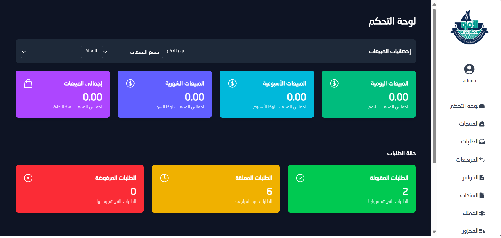
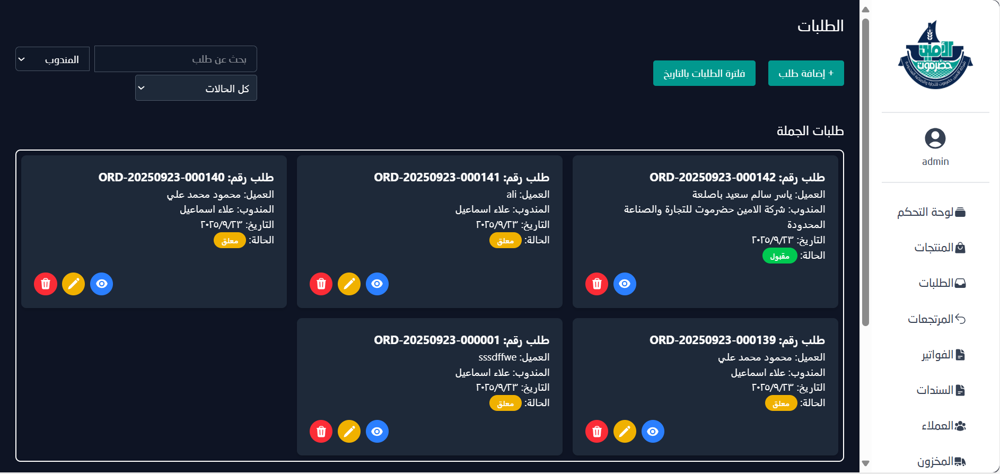
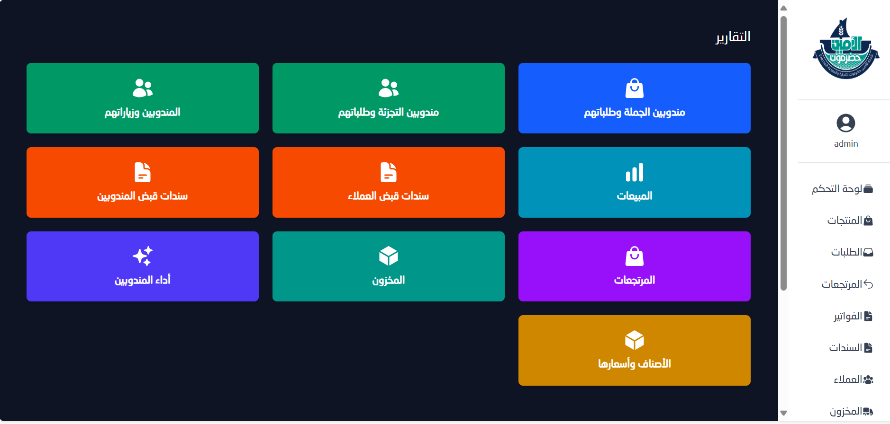

# 💼 مشروع نظام إدارة مبيعات (جملة + تجزئة)

نظام متكامل لإدارة عمليات البيع (جملة وتجزئة)، التحصيلات، العملاء، والمندوبين، مع لوحة تحكم ويب وتطبيق جوال يعمل أوفلاين ويدعم المزامنة عند الاتصال.

---

## 🎯 الهدف

- تنظيم عمليات **المبيعات (جملة + تجزئة)**.  
- إدارة **العملاء، الطلبات، الفواتير، والتحصيلات**.  
- متابعة **زيارات المندوبين والمخزون (السيارة)**.  
- إصدار **تقارير دقيقة لإدارة الأداء والأرباح**.

---

## 👤 الأدوار الرئيسية

### 🧑‍💼 المدير (Admin – الويب)
- إدارة المستخدمين، العملاء، المنتجات، الأصناف، العملات.  
- إدارة الطلبات، الفواتير، وسندات الدفع.  
- تقارير تفصيلية لأداء المندوبين والمخزون.  
- التحكم في الصلاحيات والأدوار.

---

### 🚗 مندوب التجزئة (Retail – التطبيق)
- تسجيل الطلبات والفواتير والتحصيلات.  
- متابعة العملاء وزياراتهم اليومية.  
- إدارة **المخزون داخل السيارة**.  
- استقبال إشعارات فورية بالتحديثات.

---

### 🚛 مندوب الجملة (Wholesale – التطبيق)
- إدارة الطلبات الكبيرة وعلاقات العملاء.  
- تتبع الزيارات والمبيعات.  
- استقبال إشعارات فورية ومتابعة الأداء.

---

## 🚀 المخرجات

- 💡 نظام متكامل لإدارة المبيعات والتحصيلات.  
- 🔔 إشعارات وتنبيهات فورية.  
- 📱 تطبيق جوال للمندوبين يعمل **أوفلاين** ويقوم بالمزامنة تلقائيًا عند الاتصال.  
- 🖥️ لوحة تحكم ويب شاملة للتقارير والتحليل الإداري.

---

## 🖼 صور المشروع

### لوحة التحكم

